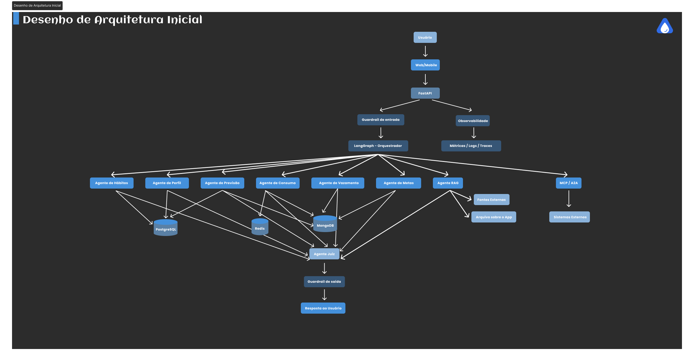

# Documentação da Arquitetura do Sistema de IA Multiagente


---

##  Visão Geral

Essa documentação define a arquitetura Inicial: em definição incremental **camada de Inteligência Artificial multiagente**, com o objetivo de oferecer um chatbot  capaz de responder perguntas sobre consumo, custos, vazamentos, metas e previsões.

---

## Requisitos

### Requisitos obrigatórios

1. API em FastAPI ou Flask — FastAPI
2. Uso de modelo de IA generativa (Gemini, GPT, DeepSeek, Claude, Groq etc.) — Gemini e Groq
4. Sistema multiagente, mínimo de 5 agentes
6. LangChain para criação dos agentes
7. LangGraph para orquestração
8. Controle de sessões por usuário
9. Memória de longo prazo
10. Integração MCP e/ou A2A
11. Mecanismos de mitigação de alucinações
12. RAG em pelo menos 1 agente com fontes identificáveis na resposta, tando de arquivos locais quanto de fontes externas (pelo menos uma deve ser consumida)
15. Agente juiz
16. Guardrails
17. Observabilidade/SRE com: 
    - Custo estimado para cenários de 100 e 1000 usuários semanais
    - Latência interagentes e tempo total de resposta
    - Indice de erros
    - Custo / Retorno (ROI)
    - Custo por resolução

### Requisitos funcionais

- Enviar perguntas ao chatbot via API;
- Identificar o usuário (`user_id`);
- Manter sessão de conversa (`session_id`);
- Rotear a pergunta para o(s) agente(s) apropriado(s);
- Consultar dados de consumo, previsão, metas e vazamento;
- Utilizar RAG quando a pergunta exigir conhecimento externo;
- Validar a resposta gerada antes de retorná-la (agente juiz + guardrails);
- Retornar as fontes utilizadas, quando aplicável;
- Registrar histórico da conversa para uso em memória de curto e longo prazo;
- Permitir observação de métricas de uso, custo e erro (uso interno/administrativo).

### Requisitos não funcionais

- **Escalabilidade** — suportar aumento do número de usuários sem redesenho da arquitetura;
- **Segurança** — proteção de dados pessoais e de consumo ;
- **Observabilidade** — rastreabilidade de custo, latência e erros;
- **Disponibilidade** — resiliência a falhas pontuais de agentes/modelos;
- **Baixa latência** — resposta em tempo aceitável para uso conversacional;
- **Rastreabilidade** — capacidade de auditar decisões dos agentes;
- **Controle de custos** — uso de modelos gratuitos/open-source sempre que possível;
- **Modularidade** — agentes e camadas desacopladas, permitindo evolução incremental.

---


## Arquitetura Multiagente

A arquitetura inicial consiste em um modelo orquestrado por LangGraph, com múltiplos agentes especializados e uma camada de verificação.



Fluxo resumido: o usuário interage via Web/Mobile → FastAPI identifica sessão e aplica guardrail de entrada → LangGraph roteia para o(s) agente(s) relevante(s), que usam LangChain para acessar o modelo de IA e as bases de dados (PostgreSQL/MongoDB/Redis) → o Agente Juiz valida a resposta → guardrail de saída → resposta retornada ao usuário. Observabilidade e integrações MCP/A2A atuam de forma transversal/futura.

---

## Responsabilidade dos Agentes

A proposta inicial é:

### Agente 1 — Consumo
Responsável por consultas relacionadas ao consumo da residência:
- consumo atual, diário, semanal, mensal;
- picos de consumo;
- histórico de consumo;
- consumo entre unidades (ranking)a. 

Perguntas que responde:

- "Quanto estou consumindo atualmente?"
- "Quanto consumi esta semana?"
- "Qual foi o maior consumo entre as minhas unidades?"
- "Como está meu consumo em comparação ao mês passado?"
- "Qual foi meu maior consumo?"
- "Meu consumo está aumentando ou diminuindo?"
- "Em quais períodos tive maior consumo?"

**Fontes de dados** MongoDB e Redis.

### Agente 2 — Vazamento
Responsável por identificar possíveis indícios de vazamento a partir de padrões de consumo:
- fluxo contínuo;
- consumo anormal;
- consumo em períodos incomuns (ex.: madrugada);
- sinalização de possível vazamento (não é um diagnóstico definitivo).

Perguntas que responde:
- "Existe algum indício de vazamento?"
- "Meu consumo apresenta algum comportamento anormal?"
- "Meu consumo está diferente do meu padrão habitual?"
- "Quando começou o possível comportamento anormal?"

**Fonte de dados**: MongoDB.

### Agente 3 — Previsão
Responsável por:
- prever consumo futuro;
- estimar valor da próxima conta;
- verificar tendência de consumo;
- verificar risco de ultrapassar a meta definida pelo usuário.

Perguntas que responde:

"Quanto devo consumir no próximo mês?"
"Qual será aproximadamente o valor da minha próxima conta?"
"Meu consumo tende a aumentar ou diminuir?"
"Vou ultrapassar minha meta?"
"Qual deve ser meu consumo no final do mês?"
"Se eu continuar consumindo nesse ritmo, quanto vou gastar?"

**Fontes de dados:** PostgreSQL(Última conta de água se for o primeiro uso e Tarifa por região) e MongoDB.

### Agente 4 — Perfil
Responsável por consultar informações cadastrais e informações relacionadas às propriedades e dispositivos do usuário.

Perguntas que responde:

- "Qual é meu nome?"
- "Minha propriedade é uma casa ou um prédio?"
- "Em qual região minha propriedade está localizada?"
- "Meu dispositivo está ativo?"

**Fonte de dados** PostgreSQL.

O agente nunca deverá retornar informações sensíveis, como senha ou credenciais armazenadas.

### Agente 5 — Hábitos
Responsável por:
- consultar e analisar hábitos
- ver a frequência e dias da semaan dos hábitos

Perguntas que responde:

- "Quais são meus hábitos cadastrados?"
- "Com que frequência eu lavo roupa?"
- "Quais hábitos tenho na segunda-feira?"

**Fontes de dados**: PostgreSQL.

### Agente 6 — RAG
Responsável por consultar conhecimento externo antes de gerar determinadas respostas (ex.: dúvidas gerais sobre conservação de água, tarifas públicas, dicas de uso consciente). Teria que fazer a diferenciação entre perfil RESIDENCIAL e COMERCIAL. Usaria processamento por chucking -> recuperação por similaridade -> resposta com citação (para atender o requisito de identificabilidade das fontes) 


#### Fonte propostas
> Documento de informações gerais do projeto;
> Conteúdo público de órgãos de saneamento/concessionárias de água, ou material educativo sobre uso consciente da água:
    - https://www.gov.br/mdr/pt-br/assuntos/seguranca-hidrica/projeto-sao-francisco/meio-ambiente-preservado/uso-consciente-da-agua
    - https://www.epa.gov/watersense/start-saving
    - https://www.epa.gov/watersense/types-facilities -> dicas de consumo de água para áreas comerciais -> teria que colocar no prompt para não indicar nada da watersense.


### Agente 7 — Juiz
Responsável por revisar as respostas dos demais agentes antes da entrega ao usuário, com foco em **mitigação de alucinações**.

Verificações previstas:
- se a resposta contém informações sem evidência/fonte de dados;
- se os dados numéricos citados são coerentes com o que foi recuperado pelos agentes especializados;
- se a resposta está alinhada ao contexto recuperado pelo RAG (quando aplicável);
- se há sinais de alucinação (ex.: menção a dados não fornecidos ao agente);
- decisão final: **aprovar** ou **solicitar regeneração**.


**Proposta:** definir um limite de tentativas de regeneração (ex.: no máximo 2) para evitar loops infinitos
---

## LangChain

**Papel no projeto:** framework utilizado para a **construção individual de cada agente** — definição de prompts, ferramentas (tools), parsing de saída e integração com o modelo de IA escolhido.

Cada agente é implementado como um agente/chain do LangChain, com:

- um **prompt de sistema** definindo seu papel e limites;
- **ferramentas (tools)** específicas (ex.: consulta ao PostgreSQL, consulta ao índice de RAG);
- uma **saída estruturada**, para facilitar o consumo pelo LangGraph e pelo agente juiz.

---

##  LangGraph

**Papel no projeto:** orquestração do fluxo multiagente como um **grafo de estados**.

Responsabilidades:
- definir os **nós** do grafo (cada agente é um nó, ou grupo de nós);
- definir as **arestas condicionais** (ex.: roteamento por intenção, decisão do juiz);
- manter o **estado compartilhado** da execução (pergunta, histórico, resultados parciais, contexto de RAG, veredito do juiz);
- permitir **execução paralela** de agentes independentes (ex.: Consumo e Vazamento podem rodar em paralelo antes do Juiz consolidar).

---

## Controle de Sessões

Cada usuário possui um `user_id`. A cada nova interação (ou conjunto de interações dentro de uma janela de tempo/contexto), o sistema associa um `session_id`.


A sessão permite:
- manter o contexto da conversa atual;
- associar múltiplas mensagens a um mesmo fluxo de atendimento;
- alimentar o estado do LangGraph durante a execução.

---

## Guardrails

Camada de validação de entrada e saída, complementar ao Agente Juiz. 

### Guardrail de entrada

Exemplos de validação — propostas arquiteturais, não regras de negócio definidas:

- **Verificação de formato e tamanho da mensagem:** validar se a entrada possui conteúdo válido e respeita limites de tamanho definidos pela aplicação;

- **Bloqueio de conteúdo fora do escopo do domínio:** impedir, quando aplicável, o processamento de perguntas não relacionadas ao Projeto Delta, como consumo de água, vazamentos, metas, previsões, hábitos, perfil da instalação ou informações gerais sobre uso consciente da água;

- **Validação de identificação:** verificar a existência de um `user_id` válido e associar a solicitação à sessão correspondente;

- **Isolamento entre usuários:** impedir que uma pergunta solicite ou utilize informações de outro usuário como contexto da resposta;

- **Sanitização básica contra Prompt Injection:** identificar e neutralizar instruções presentes na mensagem que tentem alterar as regras dos agentes, acessar informações internas ou ignorar as instruções do sistema;

- **Detecção de tentativas de acesso a informações internas:** bloquear solicitações que tentem obter prompts, credenciais, chaves de API, dados internos, ferramentas ou informações sobre a estrutura interna dos agentes;

- **Anonimização de dados pessoais, quando aplicável:** identificar e proteger informações pessoais presentes na entrada que não sejam necessárias para o processamento da solicitação;

- **Classificação semântica da entrada, quando aplicável:** utilizar um classificador para identificar categorias como solicitação aprovada, conteúdo fora do escopo, tentativa de acesso interno, Prompt Injection ou conteúdo inadequado.

### Guardrail de saída

Exemplos de validação:

- **Verificação de privacidade:** garantir que a resposta não exponha dados de outro usuário ou informações que não pertençam à sessão atual;

- **Verificação de formato da resposta:** garantir a aderência ao formato esperado pela API, como o schema JSON definido para a resposta;

- **Bloqueio de respostas que não passaram pelo Agente Juiz:** impedir que uma resposta seja entregue ao usuário caso tenha sido rejeitada ou não tenha passado pela etapa de avaliação definida na arquitetura;

- **Validação das fontes do RAG:** verificar, quando a resposta utilizar o Agente RAG, se as informações externas utilizadas possuem fonte identificável;

- **Separação entre conhecimento externo e dados da residência:** impedir que informações recuperadas de fontes externas sejam apresentadas como dados específicos da residência do usuário;

- **Validação de informações numéricas:** verificar a consistência básica de valores apresentados na resposta, como consumo, vazão, metas, previsões, valores monetários e unidades de medida;

- **Validação de estimativas:** garantir que previsões de consumo ou de valor da conta sejam apresentadas como estimativas, evitando que sejam interpretadas como valores definitivos;

- **Bloqueio de exposição de informações internas:** impedir a exposição de prompts, instruções internas, credenciais, ferramentas, estrutura interna dos agentes ou informações técnicas que não devam ser apresentadas ao usuário;

- **Proteção de dados pessoais:** impedir a exposição desnecessária de informações pessoais na resposta;

- **Validação de escopo:** impedir que o fluxo entregue respostas que não estejam relacionadas à solicitação original ou ao domínio do Projeto Delta.

---

## MCP e A2A

O Projeto Delta utilizará **MCP (Model Context Protocol)** e **A2A (Agent-to-Agent)** como mecanismos de integração com recursos externos e outros agentes.

### MCP — Integração com API de informações climáticas

O **MCP** será utilizado para disponibilizar ao sistema informações de uma **API externa de clima**, relacionada à funcionalidade **API do Tempo** prevista no Projeto Delta.

| Aspecto | Descrição |
|---|---|
| **Agente consumidor** | Agente de Consumo e Previsão|
| **Sistema externo** | API externa de informações meteorológicas |
| **Protocolo** | MCP (Model Context Protocol) |
| **Informações consultadas** | Temperatura, condição climática, probabilidade de chuva e previsão meteorológica |
| **Finalidade** | Utilizar informações climáticas como contexto adicional para analisar padrões de consumo e auxiliar nas recomendações ao usuário |
| **Benefício** | Permite disponibilizar dados meteorológicos externos aos agentes de forma padronizada, sem acoplar diretamente a lógica da API de clima ao agente |
| **Situação** | Integração definida como parte da arquitetura do Projeto Delta |

**Exemplo de utilização:**

> O sistema identifica um aumento no consumo de água e consulta, por meio do MCP, informações meteorológicas externas. Caso seja identificada uma temperatura elevada ou um período de baixa ocorrência de chuvas, essas informações poderão ser utilizadas como contexto adicional na análise do consumo.

---

### A2A — Comunicação com agente externo de pesquisa (Proposta, sujeito a alteração)

O **A2A (Agent-to-Agent)** será utilizado como mecanismo de comunicação entre os agentes do Projeto Delta e um **agente externo especializado em pesquisa** -> https://github.com/IECC-NU/a2a-research-agent

Como candidato para essa integração, propõe-se o uso do **A2A Research Agent**, um projeto open source que implementa um agente de pesquisa utilizando o protocolo A2A. O agente é especializado em realizar pesquisas externas, analisar resultados e fornecer informações acompanhadas de suas fontes.

| Aspecto | Descrição |
|---|---|
| **Agente solicitante** | Agente RAG / Orquestrador |
| **Agente externo candidato** | A2A Research Agent |
| **Protocolo** | A2A (Agent-to-Agent) |
| **Informações solicitadas** | Informações sobre uso consciente da água, conservação, eficiência hídrica, saneamento e outros conhecimentos gerais relacionados ao domínio do Projeto Delta |
| **Finalidade** | Delegar pesquisas externas para um agente especializado e complementar o conhecimento utilizado pelo Agente RAG |
| **Benefício** | Permite que o Projeto Delta se comunique com um agente independente por meio de um protocolo padronizado, sem incorporar diretamente toda a lógica de pesquisa ao próprio Agente RAG |
| **Situação** | Integração proposta / candidata para implementação |

**Exemplo de utilização:**

> O usuário pergunta: "Quais são as principais formas de reduzir o consumo de água em uma residência?"

> O Agente RAG identifica que a resposta pode se beneficiar de informações externas e solicita uma pesquisa ao A2A Research Agent. O agente externo realiza a pesquisa e retorna informações e respectivas fontes. O Agente RAG utiliza esse resultado como contexto para elaborar a resposta final, que posteriormente passa pelo Agente Juiz e pelos Guardrails.

---

## FastAPI e Endpoints

### Endpoints propostos (sujeito a alterações e adições)

- `POST /chat` - para conversas com os agentes
- `GET /chat/history/{user_id}` — histórico de conversas (sessão/memória);
- `GET /health` — verificação de disponibilidade da API de IA;
- `GET /metrics` — exposição de métricas de observabilidade (uso interno/administrativo).

Esses endpoints adicionais **não foram formalmente definidos** pela equipe e são sugestões alinhadas às necessidades de sessão, memória e observabilidade descritas neste documento.

---

## Observabilidade / SRE

A camada de observabilidade deverá permitir, futuramente, analisar:

### Latência
```
Request
 |
 +-- Agent Consumo: 400 ms
 |
 +-- Agent Previsão: 650 ms
 |
 +-- Juiz: 500 ms
 |
 +-- Total: 1.8 s
```
Métricas previstas: tempo total da requisição, tempo por agente, tempo de consulta ao banco, tempo de recuperação do RAG, tempo de resposta do modelo.

### Erros
Monitorar: erro HTTP, falha do modelo, timeout, erro de banco, erro de agente, falha no RAG, falha na integração externa.

### Custos
Métricas previstas: custo por requisição, custo por resolução, custo semanal, **custo estimado para 100 usuários semanais**, **custo estimado para 1000 usuários semanais**.

> Como a escola não custeará APIs de IA generativa pagas, a arquitetura prioriza modelos gratuitos/open-source/com créditos gratuitos (ver seção 20). Os valores reais de custo dependerão do provedor/modelo efetivamente escolhido e deverão ser recalculados quando essa decisão for tomada.

### ROI
Fórmula geral proposta:

```
ROI = retorno gerado / custo do sistema
```

O "retorno gerado" ainda não foi definido em termos de métricas de negócio do Projeto Delta (ex.: economia de água gerada pelos alertas, redução de reclamações, retenção de usuários). Essa definição é **pendente de decisão** e deve ser feita em conjunto com os responsáveis de produto.

### Stack de observabilidade
**Pendente de decisão.** Sugestões a avaliar futuramente (não definidas): ferramentas open-source de tracing/logging compatíveis com Python/FastAPI.


---
##  Estrutura de Pastas Inicial

```text
projeto-delta-ai-api/
│
├── app/
│   ├── main.py
│   ├── config.py
│   ├── schemas.py
│   │
│   ├── routes/
│   │   ├── chat.py
│   │   ├── sessions.py
│   │   └── health.py
│   │
│   ├── agents/
│   │   ├── consumo.py
│   │   ├── vazamento.py
│   │   ├── previsao.py
│   │   ├── rag.py
│   │   └── juiz.py
│   │
│   ├── graph/
│   │   ├── state.py
│   │   └── workflow.py
│   │
│   ├── memory/
│   │   ├── sessao.py
│   │   └── longo_prazo.py
│   │
│   ├── services/
│   │   ├── llms.py
│   │   └── prompts.py
│   │
│   ├── tools/
│   │   ├── db_postgres.py
│   │   ├── db_mongo.py
│   │   └── rag_retriever.py
│   │
│   ├── integrations/
│   │   ├── mcp/
│   │   │   └── weather.py
│   │   │
│   │   └── a2a/
│   │       └── research_agent.py
│   │
│   ├── guardrails/
│   │   ├── entrada.py
│   │   └── saida.py
│   │
│   └── observability/
│       └── metrics.py
│
├── data/
│   └── .gitkeep
│
├── tests/
│   ├── test_chat.py
│   └── __init__.py
│
├── .env
├── .env.example
├── requirements.txt
└── README.md
```

### Responsabilidade de cada diretório

* **`app/`** — núcleo da aplicação da API de inteligência artificial do Projeto Delta.

* **`routes/`** — definição dos endpoints HTTP da API, como `/chat`, gerenciamento de sessões e verificação de saúde da aplicação.

* **`agents/`** — implementação individual dos agentes especializados utilizando LangChain:

  * `consumo.py` — consultas e análises relacionadas ao consumo de água;
  * `vazamento.py` — identificação e análise de possíveis vazamentos;
  * `previsao.py` — previsões de consumo e gastos;
  * `rag.py` — consultas a conhecimento externo por meio de RAG;
  * `juiz.py` — avaliação e validação das respostas produzidas pelos demais agentes.

* **`graph/`** — definição do fluxo de orquestração utilizando LangGraph. `state.py` define o estado compartilhado da execução e `workflow.py` define o fluxo, nós e decisões do grafo.

* **`memory/`** — gerenciamento das sessões e da memória de longo prazo do usuário:

  * `sessao.py` — controle do contexto e das sessões de conversa;
  * `longo_prazo.py` — armazenamento e recuperação de informações destinadas à memória de longo prazo.

* **`services/`** — serviços compartilhados pela aplicação, incluindo a configuração dos modelos de IA generativa e dos prompts utilizados pelos agentes.

* **`tools/`** — ferramentas utilizadas pelos agentes para acessar dados e recursos internos do Projeto Delta:

  * `db_postgres.py` — acesso aos dados estruturados armazenados no PostgreSQL;
  * `db_mongo.py` — acesso aos dados armazenados no MongoDB;
  * `rag_retriever.py` — recuperação de informações utilizadas pelo Agente RAG.

* **`integrations/mcp/`** — integrações externas realizadas por meio do **Model Context Protocol (MCP)**. Inicialmente, será utilizada para disponibilizar informações de uma API externa de clima aos agentes do Projeto Delta.

* **`integrations/a2a/`** — integrações com agentes externos realizadas por meio do **Agent-to-Agent (A2A)**. Inicialmente, poderá conter a integração com o **A2A Research Agent**, proposto como agente externo especializado em pesquisa.

* **`guardrails/`** — validações de segurança e controle das entradas e saídas dos agentes, incluindo proteção contra prompt injection, exposição de dados de outros usuários, informações internas e respostas que não estejam de acordo com as regras do sistema.

* **`observability/`** — coleta e acompanhamento de métricas da aplicação, incluindo latência, erros, uso dos modelos e custos, quando aplicável.

* **`data/`** — diretório destinado a arquivos e dados locais utilizados pela aplicação, quando necessário.

* **`tests/`** — testes automatizados dos endpoints e dos demais componentes da aplicação.


> **Observação:** Esta estrutura representa a organização inicial do projeto. A estrutura poderá ser ajustada durante a implementação conforme novas necessidades sejam identificadas.

---

## Roadmap de Implementação

A implementação do Projeto Delta será realizada de forma incremental, priorizando inicialmente a construção e validação do núcleo de inteligência do sistema e, posteriormente, sua integração com a API, memória, integrações externas e observabilidade.

| Fase        | Escopo                                                                                                                                                                                                                                                                  |
| ----------- | ----------------------------------------------------------------------------------------------------------------------------------------------------------------------------------------------------------------------------------------------------------------------- |
| **Fase 1**  | **Configuração da base do sistema:** definição dos LLMs utilizados, variáveis de ambiente, configurações da aplicação e estrutura inicial dos serviços e prompts.                                                                                                       |
| **Fase 2**  | **Integração com os bancos de dados:** configuração das conexões com PostgreSQL e MongoDB e implementação das ferramentas (`tools`) necessárias para consulta e utilização dos dados pelos agentes.                                                                     |
| **Fase 3**  | **Implementação e testes dos agentes:** desenvolvimento dos agentes de Consumo, Vazamento, Previsão e RAG, incluindo seus prompts, ferramentas, regras de atuação e testes individuais.                                                                                 |
| **Fase 4**  | **Implementação do Agente Juiz:** criação do agente responsável por avaliar as respostas produzidas pelos demais agentes, verificando consistência, relevância e adequação ao contexto da solicitação.                                                                  |
| **Fase 5**  | **Orquestração com LangGraph:** implementação do estado compartilhado, nós, arestas e roteamento entre os agentes, integrando os agentes especializados e o Agente Juiz em um fluxo único.                                                                              |
| **Fase 6**  | **Guardrails e segurança:** implementação das validações de entrada e saída, incluindo proteção contra prompt injection, isolamento dos dados dos usuários, controle de informações internas, validação das respostas e integração com o Agente Juiz.                   |
| **Fase 7**  | **API com FastAPI:** implementação da API REST e integração do fluxo de agentes com o endpoint `/chat`, permitindo a comunicação entre o frontend e o sistema de inteligência artificial.                                                                               |
| **Fase 8**  | **Sessões e memória:** implementação do controle de sessões dos usuários, histórico de conversas e memória de longo prazo, garantindo a manutenção do contexto entre diferentes interações.                                                                             |
| **Fase 9**  | **RAG e conhecimento externo:** consolidação do Agente RAG, definição das fontes externas de conhecimento e implementação da recuperação de informações sobre uso consciente da água, conservação, eficiência hídrica e temas relacionados ao domínio do Projeto Delta. |
| **Fase 10** | **Integração MCP:** implementação da integração com a API externa de informações climáticas por meio do Model Context Protocol (MCP), disponibilizando dados meteorológicos aos agentes.                                                                                |
| **Fase 11** | **Integração A2A:** implementação e validação da comunicação com um agente externo por meio do protocolo Agent-to-Agent (A2A), utilizando inicialmente o A2A Research Agent como candidato para pesquisas externas.                                                     |
| **Fase 12** | **Endpoints complementares:** implementação e integração dos endpoints relacionados às sessões, histórico e demais recursos necessários para consumo da API pela aplicação Web/Mobile.                                                                                  |
| **Fase 13** | **Observabilidade:** implementação do monitoramento da aplicação, incluindo métricas de latência, erros, chamadas aos modelos, consumo de recursos e custos, quando aplicável.                                                                                          |
| **Fase 14** | **Testes integrados e validação final:** execução de testes envolvendo agentes, LangGraph, memória, RAG, guardrails, MCP, A2A e API, além da validação do fluxo completo do sistema.                                                                          

> **Observação:** As fases não representam necessariamente etapas isoladas ou exclusivamente sequenciais. Algumas atividades poderão ocorrer em paralelo durante a implementação. A ordem apresentada representa a dependência arquitetural recomendada para a construção e validação progressiva do Projeto Delta.