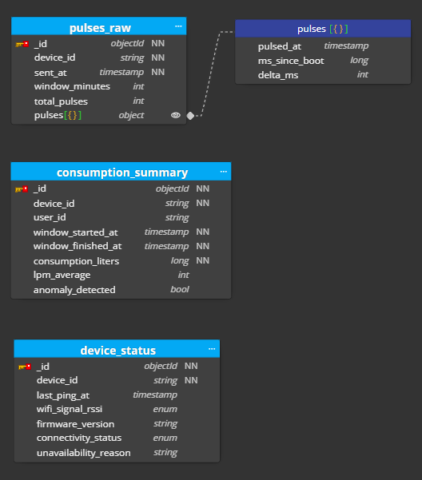
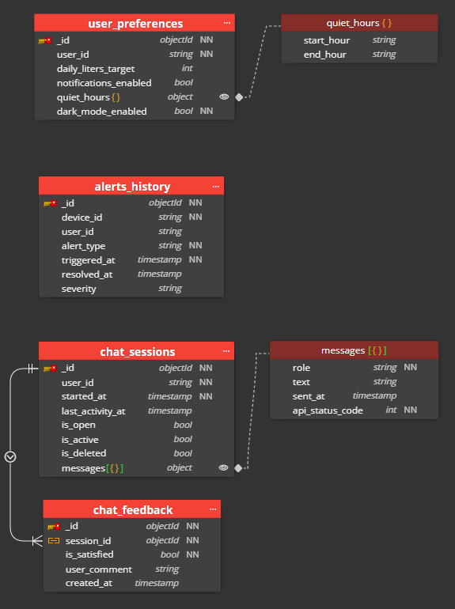

# Modelagem NoSQL (MongoDB) — Projeto Delta

Este documento define a modelagem oficial das coleções MongoDB do Projeto Delta, complementando o
[`modelagem-relacional.md`](./DADOS/SQL/modelagem-relacional.md) (que trata do PostgreSQL) e a documentação de
infraestrutura de ingestão (payloads do ESP32/Arduino e camada Redis).

O escopo aqui é estritamente o **modelo de dados**: quais coleções existem, o que cada uma armazena,
como se relacionam (ou deliberadamente não se relacionam) e quais índices sustentam essa modelagem em
produção.

---

## 1. Papel do MongoDB na Arquitetura

O Projeto Delta usa três motores de persistência, cada um com uma responsabilidade fechada:

| Motor | Responsabilidade |
|---|---|
| **PostgreSQL** | CRUD relacional obrigatório, cadastro de usuários/propriedades/dispositivos, tabelas agregadas para BI |
| **MongoDB** | Ingestão de telemetria do ESP32, domínio de aplicativo (preferências, alertas, chat) |
| **Redis** | Cache de rotina calculada pela IA, throttling de notificações, rankings (Sorted Sets) |

O MongoDB entra especificamente onde o SQL sofreria: escrita de alto volume vinda dos dispositivos IoT e
documentos com estrutura variável (histórico de mensagens de chat, preferências flexíveis por usuário).
Dados de cadastro, permissões e tudo que exige integridade referencial forte permanecem no PostgreSQL —
o MongoDB **não duplica** esse domínio.

---

## 2. Organização em Databases

A modelagem oficial usa **dois databases** dentro do mesmo cluster Atlas, separando a carga de máquina
(alto volume, escrita constante) da carga de usuário (baixo volume, leitura predominante):

| Database | Conteúdo | Padrão de carga |
|---|---|---|
| `db_delta_telemetry` | `pulses_raw`, `consumption_summary`, `device_status` | Escrita pesada e constante (ESP32 → API a cada 5 min) |
| `db_delta_app` | `user_preferences`, `alerts_history`, `chat_sessions`, `chat_feedback` | Leitura predominante, escrita esporádica (ação do usuário) |

> A separação em dois databases também define o perímetro das *custom roles* documentadas na governança
> de acesso: a credencial que a API usa para ingestão de telemetria não precisa (e não deve) ter acesso ao
> database de aplicativo, e vice-versa.

---

## 3. Database: `db_delta_telemetry`

### 3.1. `pulses_raw`

Recebe o payload bruto enviado pelo dispositivo a cada janela de 5 (ou 10) minutos, incluindo o array
detalhado de pulsos captados pelo sensor.

| Campo | Tipo | Obrigatório | Descrição |
|---|---|---|---|
| `_id` | ObjectId | Sim | Identificador do documento |
| `device_id` | string | Sim | Identificador do dispositivo (ESP32/Arduino) |
| `sent_at` | timestamp | Sim | Momento do envio do pacote |
| `window_minutes` | int | Não | Duração da janela de acumulação |
| `total_pulses` | int | Não | Total de pulsos detectados na janela |
| `pulses[]` | array de objetos | Não | Histórico detalhado de cada pulso |
| `pulses[].pulsed_at` | timestamp | Sim | Horário estimado do pulso |
| `pulses[].ms_since_boot` | long | Sim | `millis()` do dispositivo no momento do pulso |
| `pulses[].delta_ms` | int | Sim | Intervalo desde o pulso anterior na mesma janela |

```json
{
  "_id": { "$oid": "60c72b2f9b1d8b2bad723a11" },
  "device_id": "ESP32-SP-0912",
  "sent_at": "2026-07-17T17:10:00Z",
  "window_minutes": 5,
  "total_pulses": 3,
  "pulses": [
    { "pulsed_at": "2026-07-17T17:05:12Z", "ms_since_boot": 3452210, "delta_ms": 0 },
    { "pulsed_at": "2026-07-17T17:05:14Z", "ms_since_boot": 3453210, "delta_ms": 1000 },
    { "pulsed_at": "2026-07-17T17:06:45Z", "ms_since_boot": 3545210, "delta_ms": 92000 }
  ]
}
```

> ⚠️ **Coleção volátil por design.** `pulses_raw` existe apenas para alimentar a IA em tempo (quase) real e
> servir de janela de auditoria/debug de curto prazo. Ela **não é o repositório de auditoria de longo prazo**
> — esse papel é do armazenamento frio (AWS S3 / Delta Lake), lido periodicamente pelo Databricks. Ver
> seção 5 para o índice TTL que expira esses documentos automaticamente.

### 3.2. `consumption_summary`

Documento consolidado e leve, gerado pelo back-end após o processamento do `pulses_raw` pela IA. É a
fonte de dados que o aplicativo consulta para montar gráficos de consumo.

| Campo | Tipo | Obrigatório | Descrição |
|---|---|---|---|
| `_id` | ObjectId | Sim | Identificador do documento |
| `device_id` | string | Sim | Dispositivo de origem |
| `user_id` | string | Não | Usuário dono do dispositivo |
| `window_started_at` | timestamp | Sim | Início da janela resumida |
| `window_finished_at` | timestamp | Sim | Fim da janela resumida |
| `consumption_liters` | long | Sim | Volume total consumido na janela |
| `lpm_average` | int | Não | Vazão média (litros/minuto) |
| `anomaly_detected` | bool | Não | Flag setada pela IA/regras de negócio |

```json
{
  "_id": { "$oid": "60c72b2f9b1d8b2bad723a12" },
  "device_id": "ESP32-SP-0912",
  "user_id": "60c72b2f9b1d8b2bad723456",
  "window_started_at": "2026-07-17T17:05:00Z",
  "window_finished_at": "2026-07-17T17:10:00Z",
  "consumption_liters": 14,
  "lpm_average": 2,
  "anomaly_detected": false
}
```

Esta é a coleção **permanente** do banco de telemetria: não tem TTL e é ela quem sustenta o histórico do
app e a exportação diária para as tabelas de dashboard no PostgreSQL.

### 3.3. `device_status`

Documento único por dispositivo (padrão *upsert*), atualizado a cada ping. Alimenta o painel administrativo
de saúde do hardware.

| Campo | Tipo      | Obrigatório | Descrição |
|---|-----------|---|---|
| `_id` | ObjectId  | Sim | Identificador do documento |
| `device_id` | string    | Sim | Identificador do dispositivo |
| `last_ping_at` | timestamp | Não | Último contato recebido |
| `wifi_signal_rssi` | string    | Não | Faixa de sinal Wi-Fi (ex.: `excellent`, `good`, `weak`, `critical`) |
| `firmware_version` | string    | Não | Versão do firmware instalado |
| `connectivity_status` | string    | Não | `online` / `offline` / `unstable` |
| `unavailability_reason` | string    | Não | Motivo registrado quando `connectivity_status != online` |

```json
{
  "_id": { "$oid": "60c72b2f9b1d8b2bad723a20" },
  "device_id": "ESP32-SP-0912",
  "last_ping_at": "2026-07-17T17:10:00Z",
  "wifi_signal_rssi": "good",
  "firmware_version": "v1.2.3",
  "connectivity_status": "online",
  "unavailability_reason": null
}
```

---

## 4. Database: `db_delta_app`

### 4.1. `user_preferences`

Documento único por usuário, armazenando preferências de notificação, metas, tema e outras configurações.

| Campo | Tipo | Obrigatório | Descrição |
|---|---|---|---|
| `_id` | ObjectId | Sim | Identificador do documento |
| `user_id` | string | Sim | Usuário dono das preferências |
| `daily_liters_target` | int | Não | Meta diária de consumo |
| `notifications_enabled` | bool | Não | Liga/desliga notificações push |
| `quiet_hours` | objeto | Não | Janela de silêncio de alertas |
| `quiet_hours.start_hour` | string | Não | Início do período (ex.: `"22:00"`) |
| `quiet_hours.end_hour` | string | Não | Fim do período (ex.: `"06:00"`) |
| `dark_mode_enabled` | bool | Sim | Preferência visual do app |

```json
{
  "_id": { "$oid": "60c72b2f9b1d8b2bad723b01" },
  "user_id": "60c72b2f9b1d8b2bad723456",
  "daily_liters_target": 300,
  "notifications_enabled": true,
  "quiet_hours": { "start_hour": "22:00", "end_hour": "06:00" },
  "dark_mode_enabled": false
}
```

### 4.2. `alerts_history`

Registro definitivo de cada anomalia disparada pela IA/regras de negócio — é o que o app renderiza na tela
de notificações do usuário.

| Campo | Tipo | Obrigatório | Descrição |
|---|---|---|---|
| `_id` | ObjectId | Sim | Identificador do documento |
| `device_id` | string | Sim | Dispositivo que originou o alerta |
| `user_id` | string | Não | Usuário notificado |
| `alert_type` | string | Sim | Ex.: `vazamento_continuo`, `fluxo_atipico`, `dispositivo_offline` |
| `triggered_at` | timestamp | Sim | Momento de abertura do alerta |
| `resolved_at` | timestamp | Não | Momento de resolução (`null` enquanto ativo) |
| `severity` | string | Não | `low` / `medium` / `high` |

```json
{
  "_id": { "$oid": "60c72b2f9b1d8b2bad723b02" },
  "device_id": "ESP32-SP-0912",
  "user_id": "60c72b2f9b1d8b2bad723456",
  "alert_type": "vazamento_continuo",
  "triggered_at": "2026-07-17T03:12:00Z",
  "resolved_at": null,
  "severity": "high"
}
```

### 4.3. `chat_sessions`

Cada documento representa **uma sessão de chat completa** — não uma mensagem isolada. As mensagens
ficam embutidas em um array dentro do próprio documento (padrão *Bucket*).

| Campo | Tipo | Obrigatório | Descrição |
|---|---|---|---|
| `_id` | ObjectId | Sim | Identificador da sessão |
| `user_id` | string | Sim | Usuário dono da sessão |
| `started_at` | timestamp | Sim | Início da sessão |
| `last_activity_at` | timestamp | Sim | Última interação |
| `is_open` | bool | Não | Sessão aceita novas mensagens |
| `is_active` | bool | Não | Sessão em atendimento no momento |
| `is_deleted` | bool | Não | Soft delete (não remove o documento) |
| `messages[]` | array de objetos | Não | Mensagens da sessão, em ordem cronológica |
| `messages[].role` | string | Sim | `user` ou `bot` |
| `messages[].text` | string | Sim | Conteúdo da mensagem |
| `messages[].sent_at` | string | Sim | Horário de envio |
| `messages[].api_status_code` | int | Sim | Status retornado pela API de IA na geração da resposta |

```json
{
  "_id": { "$oid": "61a8f9c2b9d1b2bad723c001" },
  "user_id": "60c72b2f9b1d8b2bad723456",
  "started_at": "2026-07-17T14:00:00Z",
  "last_activity_at": "2026-07-17T14:05:00Z",
  "is_open": false,
  "is_active": false,
  "is_deleted": false,
  "messages": [
    { "role": "user", "text": "Por que meu consumo subiu tanto ontem?", "sent_at": "2026-07-17T14:00:05Z", "api_status_code": 200 },
    { "role": "bot", "text": "Identifiquei um fluxo contínuo de 2.8 LPM de madrugada. Pode ser um vazamento.", "sent_at": "2026-07-17T14:00:12Z", "api_status_code": 200 }
  ]
}
```

> ⚠️ **Limite de tamanho do array.** Recomenda-se travar `messages[]` em, no máximo, 50–100 entradas por
> sessão no código da aplicação. Ao atingir o limite, o back-end deve fechar a sessão (`is_open: false`) e abrir
> uma nova, evitando que o documento cresça indefinidamente e ultrapasse limites de leitura/gravação do
> MongoDB.

### 4.4. `chat_feedback`

Avaliação do usuário sobre uma sessão encerrada. Referencia `chat_sessions` por `session_id` — uma
referência lógica, não uma *foreign key* imposta pelo banco.

| Campo | Tipo | Obrigatório | Descrição |
|---|---|---|---|
| `_id` | ObjectId | Sim | Identificador do documento |
| `session_id` | ObjectId | Sim | Referência a `chat_sessions._id` |
| `is_satisfied` | bool | Sim | Avaliação binária (👍/👎) |
| `user_comment` | string | Não | Comentário livre opcional |
| `created_at` | timestamp | Não | Momento do envio do feedback |

```json
{
  "_id": { "$oid": "61a8f9c2b9d1b2bad723c050" },
  "session_id": { "$oid": "61a8f9c2b9d1b2bad723c001" },
  "is_satisfied": true,
  "user_comment": "Resolveu minha dúvida rápido.",
  "created_at": "2026-07-17T14:06:00Z"
}
```

---

## 5. Índices e Configurações de Coleção

| Coleção | Índice | Tipo | Justificativa |
|---|---|---|---|
| `pulses_raw` | `{ sent_at: 1 }` | **TTL** (`expireAfterSeconds: 604800`) | Expira o dado bruto após 7 dias. Contém o volume mais pesado de escrita do sistema; sem expiração automática, estoura o limite do cluster gratuito (M0/512 MB) em pouco tempo. A auditoria de longo prazo é responsabilidade do armazenamento frio (S3/Delta Lake), não deste banco. |
| `pulses_raw` | `{ device_id: 1, sent_at: -1 }` | Composto | Suporta consultas de debug/reprocessamento por dispositivo dentro da janela de 7 dias em que o dado ainda existe. |
| `consumption_summary` | `{ user_id: 1, window_started_at: -1 }` | Composto | Este é o índice mais crítico do database de telemetria: sustenta a leitura do histórico/gráfico de consumo do usuário no app, sempre ordenado por tempo. |
| `consumption_summary` | `{ device_id: 1 }` | Simples | Consultas administrativas e de suporte por dispositivo, independente do usuário. |
| `device_status` | `{ device_id: 1 }` | **Único** | A coleção segue padrão *upsert* (um documento por dispositivo). O índice único é o que garante essa unicidade e viabiliza `updateOne({ device_id }, ..., { upsert: true })` sem duplicatas. |
| `alerts_history` | `{ user_id: 1, triggered_at: -1 }` | Composto | Alimenta a tela de notificações do app, sempre lida por usuário e ordenada por data. |
| `alerts_history` | `{ device_id: 1, resolved_at: 1 }` | Composto (parcial, `resolved_at: null`) | Consulta rápida de "alertas ainda ativos" por dispositivo, sem varrer o histórico já resolvido. |
| `user_preferences` | `{ user_id: 1 }` | **Único** | Cada usuário deve ter exatamente um documento de preferências; o back-end lê esse documento a cada pacote de telemetria processado para checar `quiet_hours`. |
| `chat_sessions` | `{ user_id: 1, last_activity_at: -1 }` | Composto | Lista de "atendimentos anteriores" do usuário, ordenada por atividade recente. |
| `chat_sessions` | `{ user_id: 1, is_open: 1 }` | Composto | Localiza rapidamente uma sessão em aberto para decidir entre reabrir ou criar uma nova. |
| `chat_feedback` | `{ session_id: 1 }` | Simples | Suporta o cruzamento (via `$lookup` em agregação) entre sessão e sua avaliação, usado em métricas de satisfação do bot. |

---

## 6. Justificativas de Design

**Por que dois databases, e não um só ou três (como no rascunho com MongoDB/Postgres/Redis fundidos)?**
A separação entre `db_delta_telemetry` e `db_delta_app` isola dois perfis de carga completamente
diferentes — escrita massiva e constante vs. leitura esporádica orientada a usuário — e permite aplicar
*custom roles* distintas por database, reduzindo a superfície de ataque caso uma credencial vaze.

**Por que `pulses_raw` e `consumption_summary` não têm relação de chave (PK/FK)?**
Foi uma decisão deliberada, não uma omissão. `pulses_raw` tem TTL de 7 dias; se `consumption_summary`
referenciasse o `_id` de um pulso bruto, esse ponteiro ficaria órfão assim que o TTL expirasse. A "chave" real
entre as duas coleções é temporal: `device_id` + intervalo de tempo (`window_started_at`/`window_finished_at`),
que é também como o Databricks/Spark consulta o armazenamento frio para fins de auditoria.

**Por que `chat_sessions` embute as mensagens em vez de uma coleção `chat_messages` separada?**
Uma coleção com um documento por mensagem cresceria rápido demais e exigiria uma consulta com
paginação toda vez que o app abrisse uma conversa. O padrão *Bucket* (uma sessão = um documento, array
de mensagens embutido) resolve isso com uma única leitura por `_id`, ao custo de exigir um teto no
tamanho do array — daí a recomendação de 50–100 mensagens por sessão na seção 4.3.

**Por que `device_status` abandonou a ideia de usar `device_id` como `_id`?**
A proposta original (usar o identificador natural do dispositivo como `_id`) funcionaria, mas quebraria a
consistência de driver/ORM com as demais coleções, todas usando `ObjectId`. A modelagem oficial optou
por unicidade garantida via índice (`{ device_id: 1 }`, único) em vez de sobrescrever o `_id` padrão — troca
pequena, mas que evita tratamento especial nessa única coleção.

---

## 7. Diagrama de Referência

### 7.1. `db_delta_telemetry`


### 7.2. `db_delta_app`

