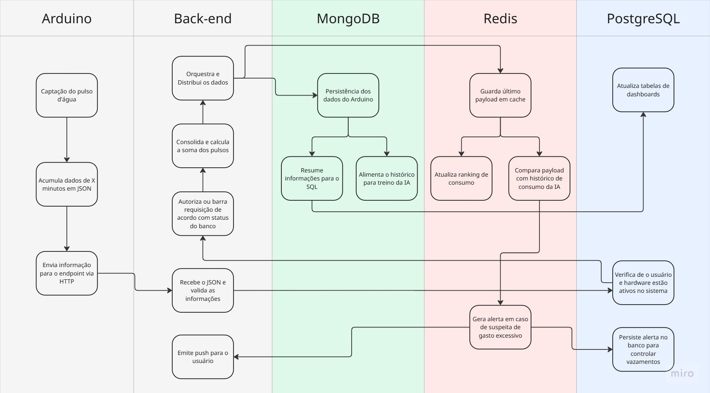

# Documento de Arquitetura e Modelagem de Dados
Este documento descreve as especificações técnicas de infraestrutura, 
modelagem e tráfego de dados para o sistema de monitoramento de consumo de água via telemetria IoT. 
A arquitetura foi planejada para garantir escalabilidade, segurança e eficiência computacional, 
dividindo as responsabilidades entre MongoDB, Redis e PostgreSQL.

## Diagrama de Arquitetura de Fluxo de Dados


## 1. Comunicação de Borda (Arduino Uno R4 Wifi)
Para mitigar problemas de concorrência e sobrecarga no servidor de aplicação, 
o hardware do Arduino Uno R4 consolidará as medições magnéticas localmente em lotes temporais (janelas de 5 a 10 minutos) 
e utilizará uma estratégia de escalonamento (Load Leveling/Jittering) para envio das requisições.

### 1.1. Payload do Arduino para a API (JSON bruto via HTTP POST)
Este é o formato de dados enxuto transmitido pelo microcontrolador. O cabeçalho da requisição deve conter o cabeçalho Authorization: Bearer <TOKEN_DE_SEGURANCA_DO_DISPOSITIVO> para autenticação na API.
```json
{
  "device_id": "ARD-R4-SP-0912",
  "timestamp_envio": "2026-06-21T17:10:00Z",
  "janela_minutos": 5,
  "pulsos_acumulados": 14
}
```

#### Descrição dos Campos:
- device_id: Identificador único do hardware registrado no banco SQL.
- timestamp_envio: Horário exato que o Arduino finalizou a contagem e iniciou o envio (padrão ISO 8601 UTC).
- janela_minutos: Tempo de amostragem configurado no firmware do Arduino.
- pulsos_acumulados: Soma física de pulsos magnéticos detectados pela porta de interrupção do hardware no período.

## 2. Processamento e Consolidação no Back-end
Conforme validado no desenho de arquitetura, o Back-end assume a responsabilidade de processar o payload imediatamente após a autenticação.

### Justificativa de Engenharia de Dados:
Decisão de Projeto: Em vez de armazenar arrays complexos de timestamps individuais para cada pulso 
(o que inflaria o armazenamento e tornaria as consultas matemáticas lentas), o Back-end calcula 
e consolida o volume métrico antes da persistência.

Assumindo que `1 pulso = 1 litro` (ou a proporção calibrada do hidrômetro), o Back-end converte pulsos diretamente em volume utilizável, 
simplificando as análises estatísticas da IA e o cálculo do ranking.

### 2.1. Payload Consolidado enviado aos Bancos de Dados
```json{
  "usuario_id": "60c72b2f9b1d8b2bad723456",
  "device_id": "ARD-R4-SP-0912",
  "data_inicio_leitura": "2026-06-21T17:05:00Z",
  "data_fim_leitura": "2026-06-21T17:10:00Z",
  "consumo_litros": 14,
  "vazao_media_lpm": 2.8
}
```

## 3. Infraestrutura e Modelagem MongoDB (NoSQL)
O MongoDB é o nosso banco de ingestão de alta performance (write-heavy), responsável por armazenar todo 
o histórico analítico e logs que alimentarão o motor de inteligência artificial.

### 3.1. Collections Necessárias
#### A. Collection: leituras_historico (Armazenamento em Time-Series)
Otimizada usando a funcionalidade de Time-Series Collections nativa do MongoDB (versão 5.0+) para reduzir espaço em disco e acelerar queries cronológicas.

```javascript
// Script de criação da Collection otimizada para Time-Series
db.createCollection("leituras_historico", {
   timeseries: {
      timeField: "data_fim_leitura",
      metaField: "device_id",
      granularity: "minutes"
   }
});
```

#### B. Collection: historico_ia_treino
Armazena as conclusões e padrões de rotina gerados periodicamente pela inteligência artificial para cada usuário.

```javascript
{
  "_id": ObjectId("61a8c9b2f1d8b2bad7239999"),
  "usuario_id": "60c72b2f9b1d8b2bad723456",
  "faixas_rotina": {
    "madrugada_00_06": { "max_recomendado_litros": 5.0, "desvio_padrao": 1.2 },
    "manha_06_12": { "max_recomendado_litros": 45.0, "desvio_padrao": 5.5 },
    "tarde_12_18": { "max_recomendado_litros": 30.0, "desvio_padrao": 4.1 },
    "noite_18_00": { "max_recomendado_litros": 60.0, "desvio_padrao": 8.0 }
  },
  "ultima_atualizacao": "2026-06-21T02:00:00Z"
}
```

## 4. Infraestrutura e Comandos Redis (In-Memory)
O Redis atua como o motor de tempo real do sistema. Ele impede que o fluxo contínuo do IoT onere os bancos persistentes (Mongo/Postgres).

### 4.1. Ranking de Performance (Sorted Sets)
Para exibir o ranking de economia na Web de forma instantânea, usamos a estrutura ZSET. 
O score armazenado será o consumo acumulado no mês (quanto menor o consumo, melhor a posição no ranking).

- Adicionar/Atualizar consumo do usuário no ranking mensal:

```redis
# Incrementa o score (consumo) do usuário no ranking de Junho/2026
ZINCRBY ranking:agua:202606 14 "user_id_60c72b2f"
```

- Buscar o TOP 10 usuários mais econômicos (menor consumo):
```redis
# Retorna os usuários ordenados do menor consumo para o maior
ZRANGE ranking:agua:202606 0 9 WITHSCORES
```

### 4.2. Cache de Regras de Alerta da IA (Evitando gargalo no MongoDB)
Para evitar que cada payload recebido execute um find() no MongoDB buscando a rotina de consumo, 
o Back-end carrega as metas e limites do usuário direto no cache do Redis. A verificação do alerta 
se torna uma operação extremamente rápida de leitura de memória (GET).

- Armazenar limites de segurança definidos pela IA (atualizado uma vez por dia ou semana):
```redis
SET limite:madrugada:60c72b2f "5.0"
```

- Verificação em milissegundos no Back-end:
```javascript
// Lógica no Back-end ao receber dado de madrugada (ex: 3h AM)
const limiteMaximo = await redis.get(`limite:madrugada:${usuarioId}`);
if (payload.consumo_litros > parseFloat(limiteMaximo)) {
    dispararAlertaExcesso();
}
```

### 4.3. Gerenciamento de Sessão e Recuperação de Senhas (TTL)
Tokens de recuperação de senha usam o tempo de expiração nativa do Redis (Time-To-Live) para autolimpeza da memória.
```redis
# Define o token de redefinição de senha com validade estrita de 15 minutos (900 segundos)
SET token:recuperar:user_60c72b2f "982134" EX 900
```

## 5. Infraestrutura PostgreSQL (Relacional)
O PostgreSQL é a âncora relacional da aplicação. Ele é responsável por manter a integridade transacional 
de dados cadastrais e o consumo consolidado para os Dashboards Web.

### 5.1. DDL Crítico para Dashboards e Relatórios Rápidos
#### Tabela: dashboard_consumo_diario
Tabela atualizada por um processo assíncrono (Cron Job / Background Worker) que lê a massa de dados brutos do MongoDB uma vez ao dia e salva o resumo estruturado no PostgreSQL para consulta instantânea do Frontend Web.

```sql
CREATE TABLE dashboard_consumo_diario (
    id SERIAL PRIMARY KEY,
    usuario_id VARCHAR(24) NOT NULL, -- Referência ID do Mongo/Auth
    data_consolidada DATE NOT NULL,
    consumo_total_litros NUMERIC(10, 2) NOT NULL,
    media_vazao_lpm NUMERIC(5, 2),
    alerta_disparado BOOLEAN DEFAULT FALSE,
    criado_em TIMESTAMP WITH TIME ZONE DEFAULT CURRENT_TIMESTAMP,
    CONSTRAINT uq_usuario_data UNIQUE (usuario_id, data_consolidada)
);

CREATE INDEX idx_dash_usuario_data ON dashboard_consumo_diario(usuario_id, data_consolidada);
```

#### Tabela: alertas_vazamentos
Para alimentar a área de auditoria e controle de anomalias na aplicação Web, esta tabela registra todos os alertas confirmados pelo processamento de eventos do Redis.

```sql
CREATE TABLE alertas_vazamentos (
    id SERIAL PRIMARY KEY,
    usuario_id VARCHAR(24) NOT NULL,
    data_alerta TIMESTAMP WITH TIME ZONE DEFAULT CURRENT_TIMESTAMP,
    tipo_alerta VARCHAR(50) NOT NULL, -- 'EXCESSO_MADRUGADA', 'GARGALO_VAZAMENTO_DIRETO'
    volume_registrado_litros NUMERIC(10, 2) NOT NULL,
    status_resolvido BOOLEAN DEFAULT FALSE,
    resolvido_em TIMESTAMP WITH TIME ZONE
);
```

## 🛠️ Resumo Técnico das Responsabilidades
| Tecnologia | Responsabilidade Principal | Justificativa Técnica |
|------------|---------------------------|-----------------------|
| MongoDB    | Dados brutos, histórico analítico e IA. | Time-Series Collections para compactação e indexação temporal eficiente. |
| Redis      | Rankings Web, cache de limites da IA, e controle de Sessões/TTL. | Uso de Sorted Sets para ordenação sem CPU-bound e verificação direta em memória RAM. |
| PostgreSQL | Cadastro (CRUD), Auditoria de Alertas e Tabelas de Consumo Consolidado. | Indexes compostos nas chaves estrangeiras e datas. Dados agregados de forma assíncrona. |
